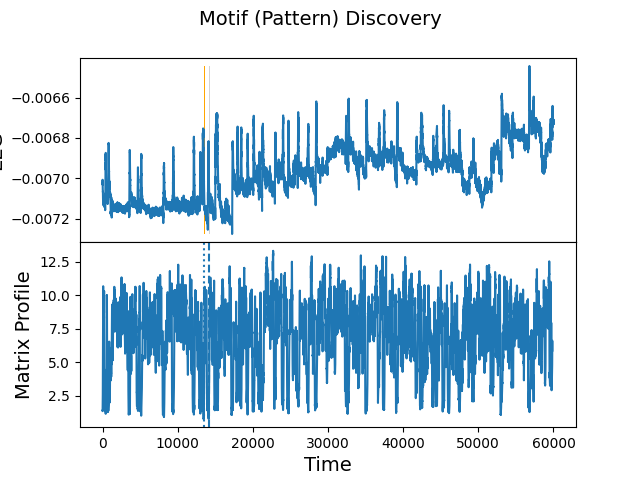

# PhysioProcessing
Process electrophysiology signals

## Current Focus
Examining EEG data for blinks.

## Example Usage
**03/01/2024 Usage**

    Provide a space-delimited list of channel numbers: 14
    Provide a start time in seconds:1260
    Provide a end time in seconds:1320
    Generating plots..
    E14 Looking across 60.0s sampled at 1000Hz (60000 points) with a window of 0.15s (150 points)
    The motif is located at index 14109
    The nearest neighbor is located at index 13454
    z-normalized Euclidean between the two waveforms: 0.7977954824043514

### Produces the following plots:
#### The raw data for the specified electrode and time frame.

#### Examing the raw signal for the best matching waveform for a specified window size.
* Top plot:  The raw data for the user specifications.  
The vertical patches/lines are the most similar pair of waveforms.
* Bottom plot: the dissimilarity magnitude for the most similar waveform within a specified time window.
(Current window parameter set to 150ms)
The vertical lines are the lowest dissimilarity values encountered.

#### A zoomed in view of the matching waveforms.
* Top plot: The two best matching waveforms are highlighted in color for a restricted range of the data
* Bottom plot:  The matching waveforms superimposed.

#### A sorted plot of the dissimilarity measures which is a Euclidan dstance.
